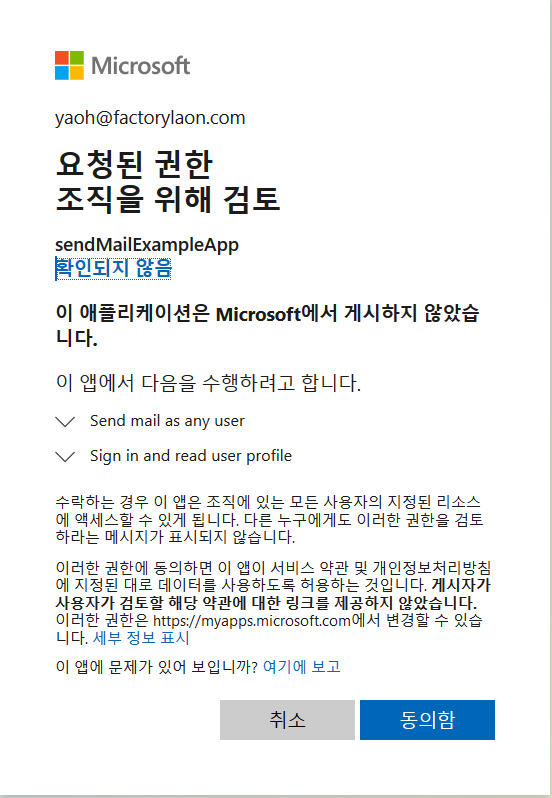
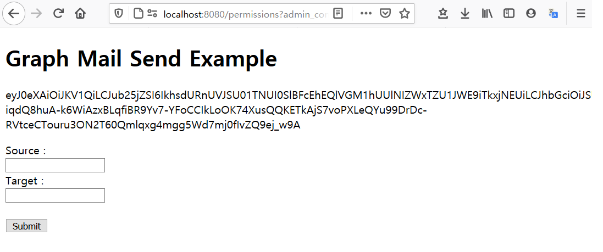

# MS Graph 메일 전송 예제  (클라이언트 자격증명 흐름) 
Azure AD 응용 프로그램 자격인증으로 MS Graph에 인증하여 다른 사람 메일로 메일 보내기 샘플입니다.

이 예제는 최소 설정으로 실행할 수 있도록 사전에 이미 등록된  Azure AD 응용프로그램을 사용합니다.

## 사전 준비 사항
- [Azure AD 어플리케이션 등록 및 구성](/Resister_AzureAD.md)

## 로컬에서 샘플 실행

``` bash
git clone https://github.com/pryaoh-helper/graph-mailSend-example.git
cd graph-mailSend-example
npm install
npm run start
```
이후 브라우저에서 http://localhost:8080 으로 실행하면 아래와 같은 화면을 확인가능합니다.


로그인 한 후 관리자동의 창에서 동의함을 선택합니다.



메일 전송 테스트를 수행합니다.



## 참고
- [Microsoft OAUTH 2.0 클라이언트 자격 증명 흐름](https://docs.microsoft.com/ko-kr/azure/active-directory/develop/v2-oauth2-client-creds-grant-flow)
- [Send Mail Api Reference](https://docs.microsoft.com/en-us/graph/api/user-sendmail?view=graph-rest-1.0&tabs=http)